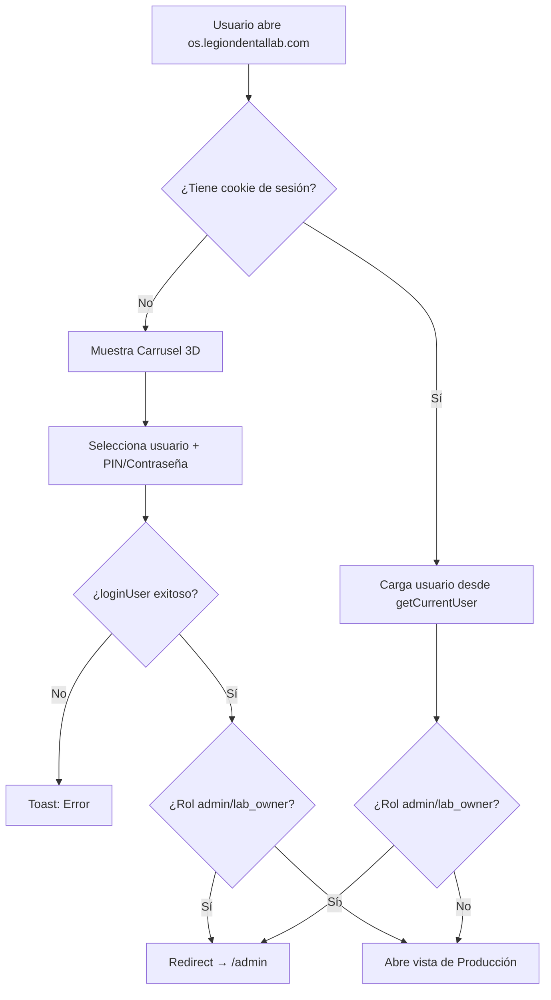

# Walkthrough — Revisión General del Sistema Lab OS

## Resumen de la Sesión

Sesión enfocada en estabilizar la arquitectura de roles, autenticación y redirecciones del sistema Lab OS.

---

## Arquitectura de Roles (Estado Final)

| Rol | Usuario | Acceso | Contraseña | Login desde |
|---|---|---|---|---|
| **SuperAdmin** (Coloratura) | `admin@coloratura.com` | `/saas` (panel global) | `SuperPassword2026!` | `/acceso` (email+pass) |
| **Lab Admin** (Dueño del Lab) | `legion` | `/admin` (panel administrativo) | `.Dgs2621459` | Carrusel principal `/` |
| **Admin** (Staff administrativo) | `Admin` | `/admin` (panel administrativo) | `LabLegion2026!` | Carrusel principal `/` |
| **Operarios** (Producción) | Nilda, Vane, Douglas... | `/` (producción) | PIN de 4 dígitos | Carrusel principal `/` |

---

## Cambios Realizados

### 1. Limpieza de Admin Layout
**Archivo:** [layout.js](file:///Users/douglasvaldez/Desktop/programa/lab-os-web/src/app/admin/layout.js)
- ❌ Removidos mensajes de debug (`JSON.stringify(user)`, "No estás autenticado")
- ✅ Restaurados `redirect('/')` limpios para producción
- ✅ Lógica de acceso simplificada y bien comentada

### 2. Corrección de Doble Redirección
**Archivo:** [page.js](file:///Users/douglasvaldez/Desktop/programa/lab-os-web/src/app/page.js)
- ❌ Eliminada redirección duplicada (`hasAdminAccess` useEffect que solo cubría admin/coloraturacorp)
- ✅ Mantenida una sola redirección unificada (línea ~893) que cubre: `lab_owner`, `admin`, `legion`, `coloraturacorp`, y `Administrativo`

### 3. Gestión de Usuarios — Tipo de Perfil
**Archivo:** [usuarios/page.js](file:///Users/douglasvaldez/Desktop/programa/lab-os-web/src/app/admin/usuarios/page.js)
- ✅ Agregado toggle visual de "🛡️ Administrativo" vs "⚙️ Producción"
- ✅ Renombrado rol `Admin` → `Administrativo` para claridad
- ✅ Las etapas de producción se filtran del toggle para evitar confusión

### 4. Credenciales de Legion
- ✅ Email de auth: `legion@lablegion.com` (sistema interno)
- ✅ Contraseña actualizada a `.Dgs2621459`
- ✅ `app_metadata.role = 'lab_owner'`

### 5. Limpieza General
- ✅ Eliminados 7 scripts temporales de depuración del directorio raíz
- ✅ Git limpio, sin archivos sin trackear

---

## Flujo de Autenticación (Diagrama)

---

## Estado del Sistema

| Componente | Estado |
|---|---|
| Login Carrusel | ✅ Funcionando |
| Redirección Admin | ✅ Sin loops |
| Redirección Producción | ✅ Funcionando |
| Logout | ✅ Limpia cookies + signOut |
| Gestión de Usuarios | ✅ Con toggle Administrativo/Producción |
| `/acceso` (SuperAdmin) | ✅ Funcionando |
| Debug messages | ✅ Eliminados |
| Scripts temporales | ✅ Eliminados |

---

## Pendientes para Mañana

1. **Dashboard `/saas`**: Falta construir la interfaz del panel SuperAdmin
2. **Verificar en producción**: Confirmar que Legion y Admin acceden correctamente a `/admin` desde el carrusel en `os.legiondentallab.com`
3. **Actualizar rol de Admin en DB**: El usuario "Admin" actualmente tiene roles de producción en la DB. Si se desea que sea puramente administrativo, hay que editarlo desde Gestión de Usuarios y marcar "🛡️ Administrativo"
